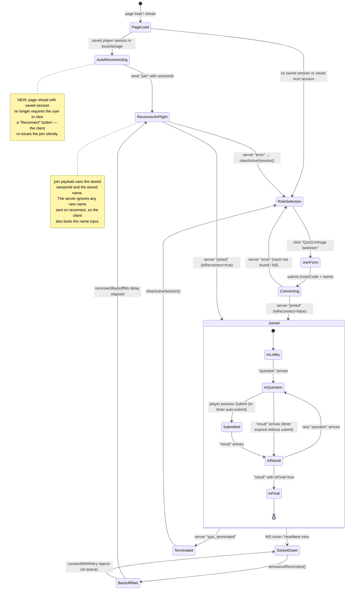
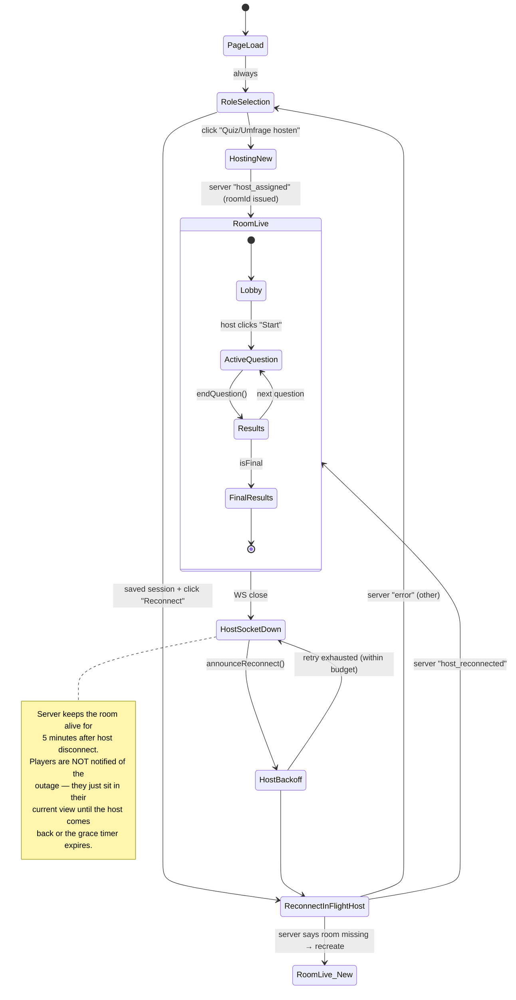
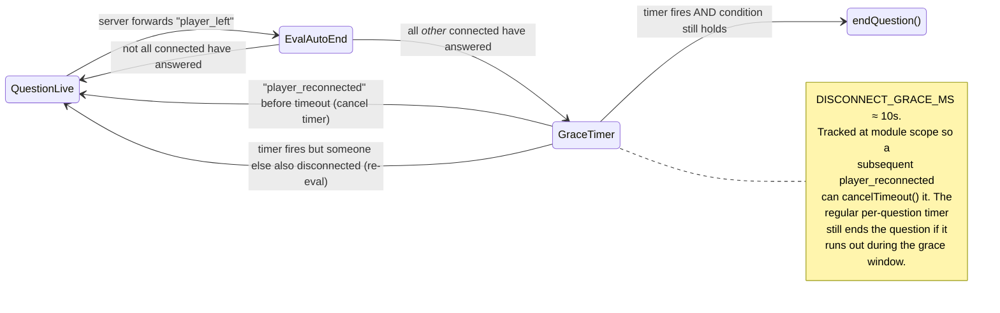

# Connect / Reconnect State Diagrams

These diagrams cover **player** and **host** lifecycle states across page load,
network blips, and full page reloads, for both `quiz.html` and `poll.html`.

The two clients share the same WebSocket protocol with `server/server.js`, so
the states are nearly identical — quiz-specific notes are inline.

## Player lifecycle

## Host lifecycle

Unlike the player, the host is *not* auto-reconnected on page reload — they
need an explicit choice between resuming an existing game and starting a
fresh one. A saved host session surfaces the "Reconnect" button on
role-selection (pulsing CTA) instead of jumping straight in.

## Mid-question disconnect — what the host does

This is the slice that motivated the rework. Before: a player reloading
mid-question caused the host to immediately call `endQuestion()` because the
remaining connected players had all answered. After: a grace timer holds the
auto-end so the reloader can rejoin.

## State-coverage checklist

Each row maps to a code path that must keep working after the rework. Cells
filled in with the file/symbol that handles it.

| Scenario | Player handling | Host handling | Server handling |
|---|---|---|---|
| First-ever join | `initPlayerConnection` (quiz) / `submitJoin` (poll) | `player_joined` event | `handleJoin` new-player branch |
| Reload in lobby | NEW: auto `initializePlayerFeatures({reconnectInfo})` on `DOMContentLoaded` | `player_left` then `player_reconnected` | `handleJoin` reconnect branch (phase=lobby) |
| Reload mid-question | Same as above; server re-sends `question` with `remaining` and `alreadySubmitted` | NEW: `player_left` schedules grace timer instead of immediate `endQuestion` | `handleJoin` reconnect branch (phase=question replay) |
| Reload mid-result | Same as above; client parks on "Quiz läuft" until next question | `player_left`/`player_reconnected` | `handleJoin` reconnect branch (phase=result, no replay payload — acceptable) |
| Reload after final | Same as above | n/a (game over) | `handleJoin` reconnect branch (phase=final → replay finalSnapshot) |
| Transient WS drop (no reload) | `close` → `connectPlayerWs` → re-`join` with current `sessionId` | Same as reload-in-lobby for the host | Same as reload paths |
| Server restart (SIGTERM) | Receives `quiz_terminated` → reset | Receives `quiz_terminated` → reset | Broadcasts then exits |
| Room expired while reconnecting | Server replies `error` → `resetPlayerStateAndUI()` clears session, lands on role-selection | n/a | Reply with `error` |
| Player tries to rename on reconnect | NEW: name input locked when reconnect path active; client always sends stored name | n/a | `handleJoin` reconnect branch already ignores `playerName` |

Anything not in this table is a state we are not handling on purpose (e.g. two
players reloading at the same instant — both just take the standard reconnect
path and the grace timer covers either ordering).
